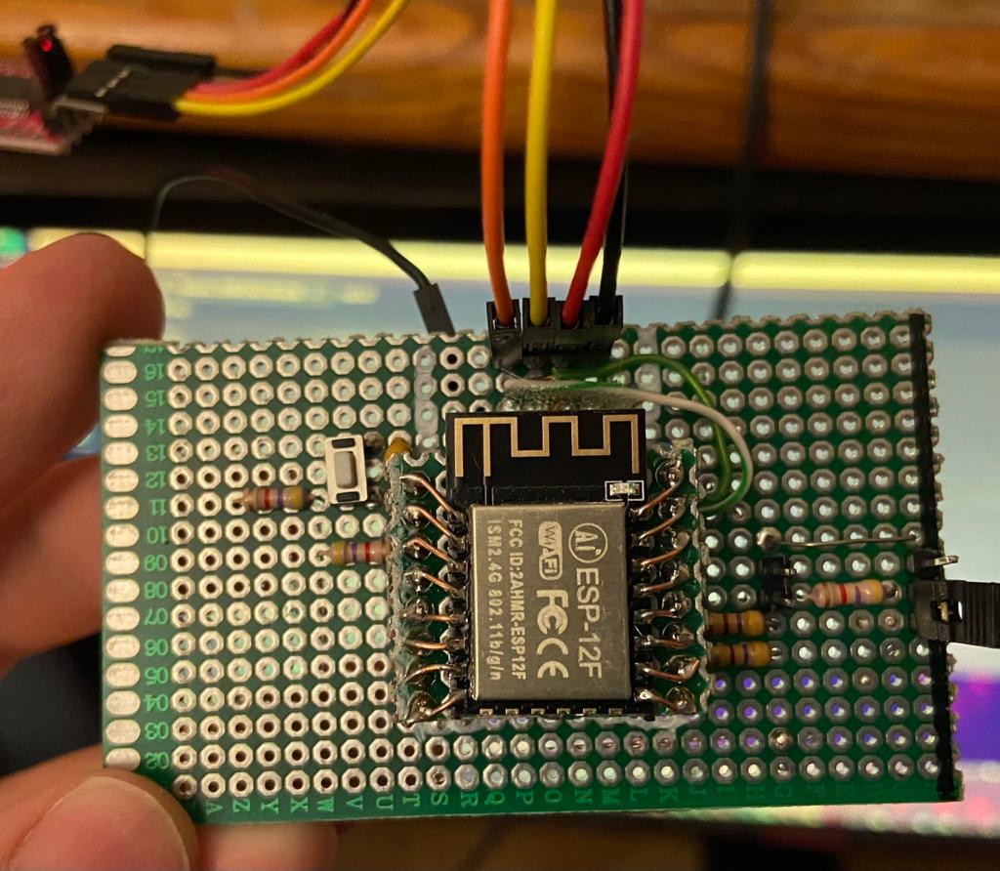
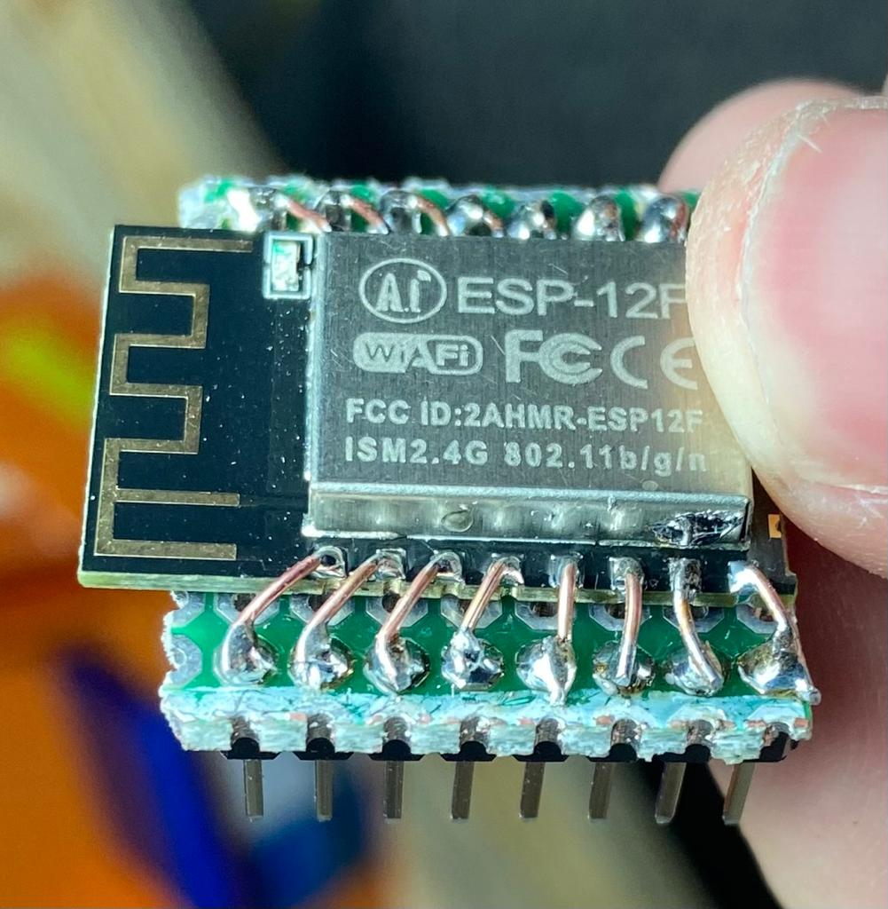
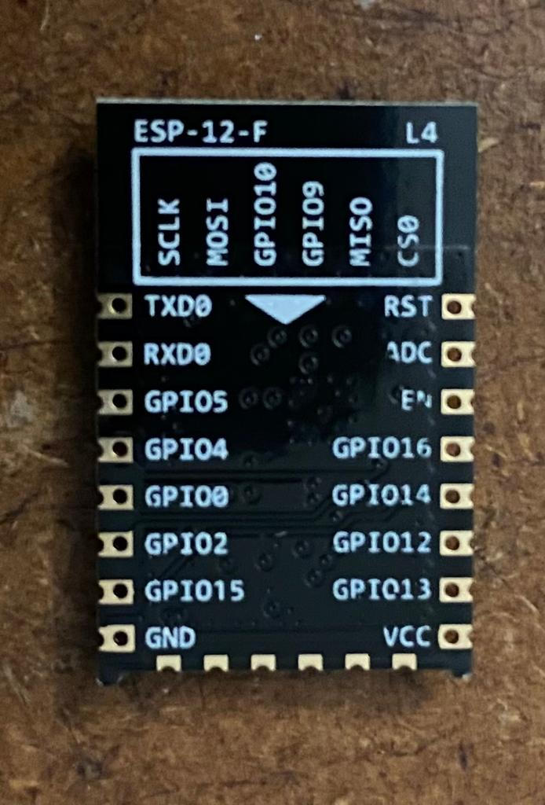
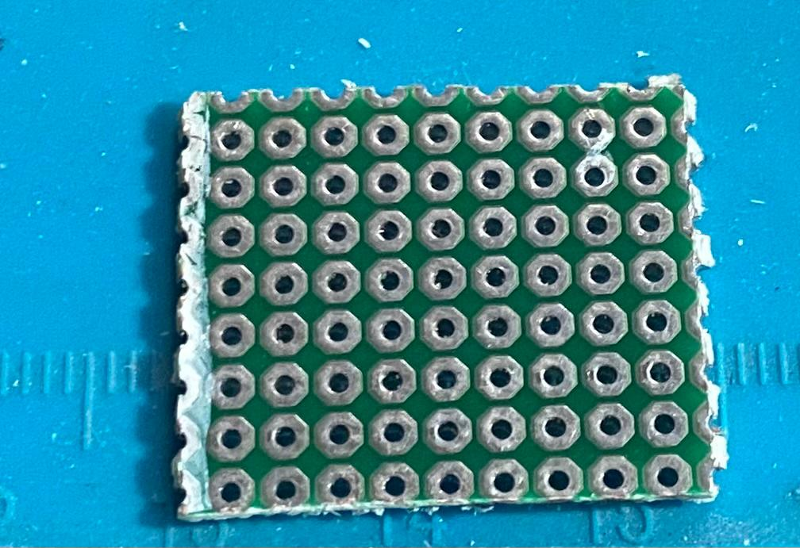

# DIY ESP8266 12F Programmer

Link to my article on my tutorial website [here]().

Creating a PCB to program the ESP8266 12F boards with an 3.3v FTDI board.

the pullup and pulldown resistor values are not too important however a high resistor like 100K will pull less curent and is good for battery aplications. Also don't use a very high resistor value on IO15 pulldown because then your ESP will not boot up.

On this PCB I used 3x 4.7k and 2x 470 Ohm resistors and they work fine for this example.

Usally I will use 4x 100K and 1x 10K on my PCBs using LiPo chargers

required components:

- 1x small pcb
- 1x large pcb
- 5x resistors
- 1x button
- 1x jumper
- 1x FTDI programmer
female and male headers

