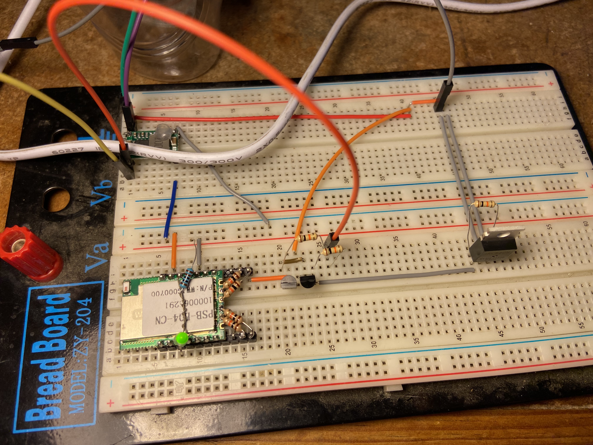

# LED mosfet switch

A simple PCB using the sonoff P04 Esp8266 modual to switch mosfets for my workshop.

The unit has an auto backup battery switching circuit and uses 12v from mains and battery and also has WiFi capability.

Buttons can be connected via Lan cable to another button PCB wich can be placed under desks or behind cupboards or in other confidential places.

Mosfets used can handel up to 10A of current and I have applied a heatsink to the LED Fet which could draw up to 7.5A.

The other 3 Fets are for: remote alarm siren, remote operation of 1 security gate and remote fog pepper spray.

# versions

BT138 for AC LED switching

IRL520N for DC LED switching

# Index
- 1

# Components

Component list:
- Buttons
    - 4x buttons
    - 4x 1k
- LED    
    - 1x LED
    - 1x 1k
- LED switches
    - 4x Fets
    - 4x NPN
    - 4x PNP
    - 8x 560 ohm
    - 4x 680 ohm
    - 4x 10k
    - 4x zener
- Microcontroller
    - 1x ESP8266 (PSB-04 Sonoff)
- DC/DC step down
    - 1x LM2596 Mini Buck Regulator
- Auto switch between mains 12v and battery 12v
    - 1x 12v relay
    - 1x 1k
    - 1x snubber diode
- Screw terminals
    - 6x 2pin screw term (4x fets, 2x inpu)
    - 1x 4pin screw term (1x 12v positive)

# Links

- [Cap for mp2307](https://electronics.stackexchange.com/questions/595807/what-value-of-capacitor-should-i-use-with-this-mp2307-buck-regulator)
- [LM2596](https://www.robotics.org.za/LM2596-MINI?search=step%20down)
- [NT72C-S10](https://componentsearchengine.com/part-view/NT72C-S10/NINGBO%20HUAGUAN%20ELECTRONICS)
- [Triac BT138-TO220 12A 600V](https://www.robotics.org.za/BT138-600E)
- [MOSFET IRL520N, N-TYPE, 9.8A, 100V](https://www.robotics.org.za/IRL520N-TO-220)
- 
