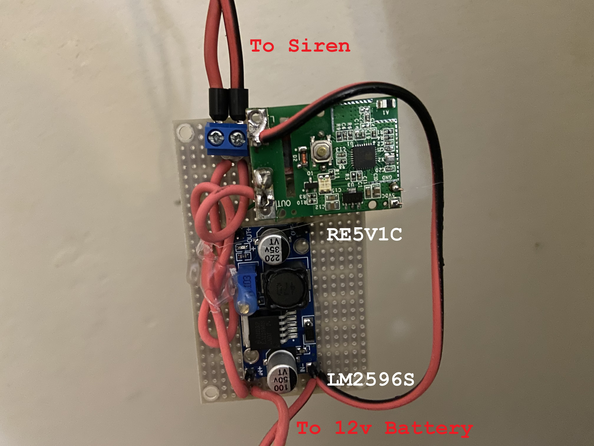

#  Sonoff RE5V1C siren ancillary PCB

The sonoff RE5V1C is a DC powered ESP8285 PCB with a 10A relay.

The PCB has a push button on it and indication LEDs but has no cover

In this example I am using the unit to switch a siren remotely.

The unit gets power from a 12v battery wich is charged from mains. 
A DC/DC buck converter steps down the 12v to 3.3v efficiently.

Unfortunately the wire I used was a nightmare to solder (cleaning helped but good quality wire is always better!)

Screw terminals secure wires to the PCB.

Component list:
- 1x Sonoff RE5V1C
- 1x two block screw terminal
- 1x LM2596 Mini Buck Regulator
- 1x stripboard board
- wire and hot glue

links
- [RE5V1C Siren Trigger](https://tutorials.techrad.co.za/2022/12/29/re5v1c-siren-trigger)
- 
