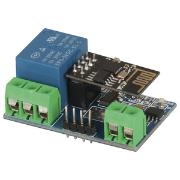

#  Duinotech Smart WiFi Relay Kit

This PCB is known as the *XC3804 Wi-Fi Relay Module*

The `STC15F104W` receives serial data from the `ESP-01` which triggers the relay.

It is triggered by pin P3_2 on the `STC15F104W`.

Component list:
- 1x XC3804 Wi-Fi Relay Module

links
- [Duinotech wifi relay](https://www.jaycar.com.au/duinotech-smart-wifi-relay-kit/p/XC3804)
- 
