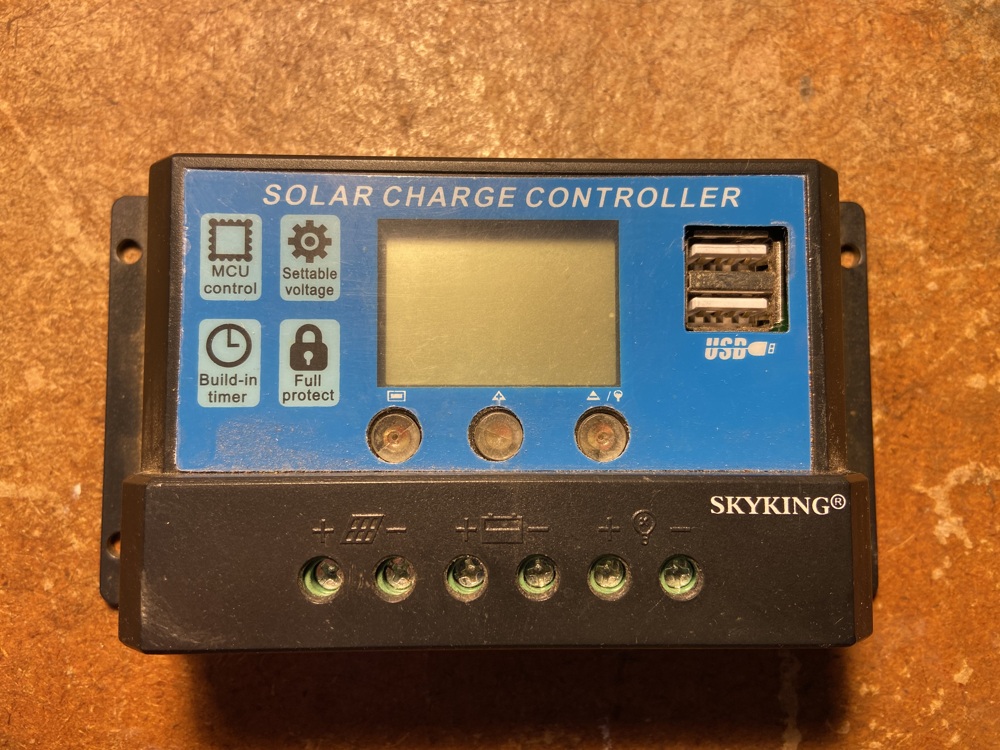

#  PWM Solar Data Forwarder

Solar PWM device forwarding stats via ESP8266

Uses a clone of the `STM8S103F2` as a mcu.. the so called `CR8F103K3`.

Component list:
- 1x PWM solar device
- 1x ESP8266

links
- [data](data)
- 
