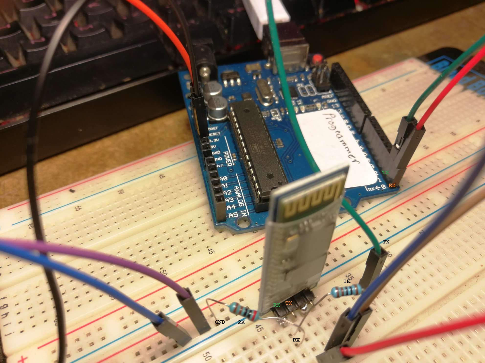

Load a blank arduino sketch and connect the TX and RX pins to the TX and RX pins on the arduino.

Remember to create a voltage divider with a 1K and 2K resistor to convert the 5V signal to 3.3V signal from the arduino to the HC-06.

Now you can send AT, if the responce is OK then it's working.

[](img/setup.JPEG)

```C++
//Blank sket allows TX and RX comms between Arduino and Bluetooth Module
void setup() 
{
}

void loop() 
{
}
```

```C++
/*
 * HC-06 Bluetooth Module
 */
int state = 0;

void setup() {
  pinMode(LED_BUILTIN, OUTPUT);
  digitalWrite(LED_BUILTIN, LOW);
  Serial.begin(9600); // Default communication rate of the Bluetooth module
}

void loop() {
 if(Serial.available() > 0){ // Checks whether data is comming from the serial port
    state = Serial.read(); // Reads the data from the serial port
 }
 // Controlling the LED
 if (state == '1') {
  digitalWrite(LED_BUILTIN, HIGH); // LED ON
  state = 0;
  Serial.println("LED ON");
 }
 else if (state == '0') {
  digitalWrite(LED_BUILTIN, LOW); // LED OFF
  state = 0;
  Serial.println("LED OFF");
 }
}
```