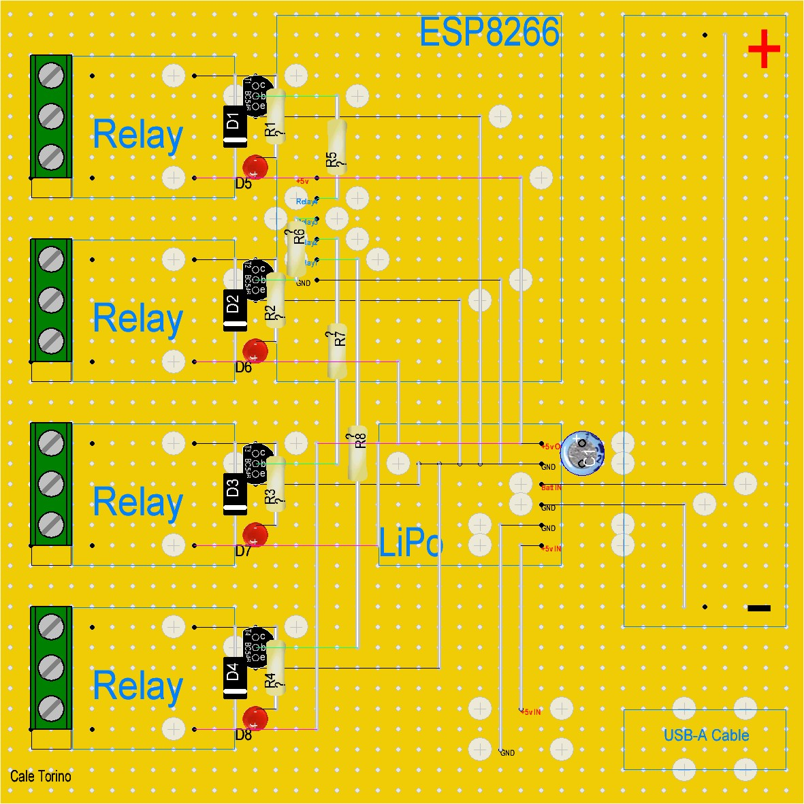
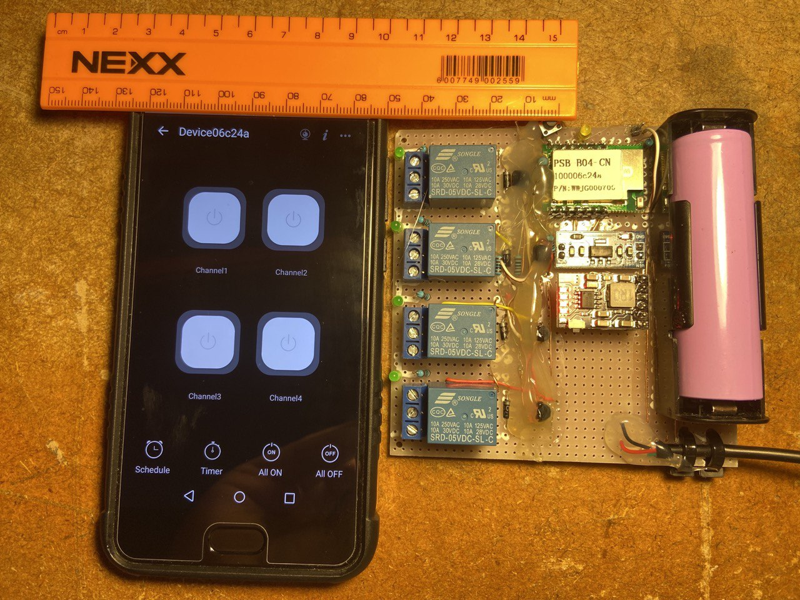

# Diy ESP8266 PSB-04-CN 4ch Relay

https://user-images.githubusercontent.com/52330180/190706517-0a584dca-c596-4cc6-8c41-7f4a87a8c2d9.mp4

Creating A 4ch relay board with a backup LiPo battery.

Please note: _**This is version 1.0**_, just getting a feel with a lot of wires, testing points and hot glue.

Subsequent versions will be user friendly.

### Version 1.1 layout

The reason I am using Ewelink module is because all the software and firmware has already been tested and supplied.

I found that using my own software and firmware requires:

- Constant connection to a server
- MQTT support and/or
- HTTP - TCP support
- A web frontend and/or
- Mobile application
- API to glue everything together
- Watchdog in software and/or in hardware
- Firmware with many fail-safe attributes

So instead of doing all the above aforementioned work using a simple module saves time.

Also connection over the internet is a must as well as local.

I have created firmware that works via TCP and a MQTT version, which can TX and RX to any ESP8266 0r ESP32 module but it needs a server 24/7.

Hence for simplicity and ease I decided to go with a eWelink programmed ESP8266 module.

Perhaps in future I will setup a permenent IOT self managed server.

However just the module costs 3 times more than purchasing an ESP8266 module by itself and not Ewelink programmed.

I hope to find cheaper modules Ewelink programmed in future.

---

Relay board v1.0 made on strip board.

GPIO-0 and Channel must be brought to GND for 5s to go into pairing mode.

First time I had to use Ewelink compatible mode for old firmware v1.1.0

 - Features
    - Power part
        - 5v USB-A (plugs in to cellphone charger etc.)
    - Battery part
        - LiPo battery backup 5000mAh
        - Charge and Discharge, Over Current Protection (OCP), Over-Voltage Protection (OVP), Short Circuit Protection (SCP), Over Temperature Protection (OTP)
        - 2A current
    - Board part
        - Ewelink ESP8266 PSB-04 
        - 4 relays
        - No firmware or software needed (use Ewelink features)

- Suggested improvements
    - Move ststus LEDs away from relay NO and NC area (Danger if high voltages used)
    - Opto-Isolate relays [PC817 Opto Isolator](https://www.robotics.org.za/PC817-DIP)
    - Use TP4056 1A basic LiPo charger instead of 2A MH-CD42 (overkill and less reliable, more expensive) [TP4056](https://www.robotics.org.za/PK4056?search=4056) or [with DC-DC Boost](https://www.robotics.org.za/J5019?search=step%20up)
    - Maybe use 18650 batt instead of 21700 (less capacity but more common) [18650 Battery Holder](https://www.robotics.org.za/18650-1C-TH?search=18650) and [18650 Battery](https://www.robotics.org.za/INR18650-35E?search=18650)
    - Replace overkill 1A Diode with [1N4148](https://www.robotics.org.za/1N4148)
    - Look for newer and cheaper Ewelink programmed ESP module
    - Add female headers for all modules
    - Correct drill bit for relay terminals and pins
    - Add power switch between LiPo charger and battery

- Rough Price list (no opto isolater and no battery)
    - R147.20 1x ESP8266 Based 4-Channel Switch
    - R32.20 4x relays (R8.05 for 1)
    - R13.80 1x AMS1117 3.3V Regulator Module
    - R25.30 1x Veroboard 100 x 100 mm
    - R41.40 1x LiPo Charger 3.7V with DC-DC Boost 4.5-24V
    - R135.70 1x Samsung 18650 3500mA 3.7V
    - R10.35 1x battery holder
    - R11.50 x1 USB A Pictail Cable, 30cm

Total: 
- With battery: **R417.45** as of 15th Sep 2022
- Without battery: **R281.75** as of 15th Sep 2022

Plus electricity and solder, labour (JLC pcb designed board instead of veroboard)

Even better if you can find old laptop batteries and harvest the 18650 cells for free. Be sure to check voltage and capacity properly.
- Charge at 4.0v 100mA low current
- Once voltage is up add to Li-ion/Lipo charger

Local commercial 4ch relay modal without battery backup price for comparison:
- R299.00 + shipping [TUYA 4CH Wifi](https://dlifesa.com/products/wifi-control-smart-life-tuya-4ch-door-opener-relay-module?variant=39402464477251&currency=ZAR&utm_medium=product_sync&utm_source=google&utm_content=sag_organic&utm_campaign=sag_organic)
- R409.00 + shipping [eWelink WiFi/RF 4 CH](https://www.geewiz.co.za/sonoff-basic-r2-r3-smart-switch/176471-eachen-wifi-rf-4-channel-inching-relay-momentaryself-lockinginterlock-switch-module-st-dc4.html)
- R429.00 + shipping [eWelink WiFi/RF ST-DC4](https://eiferer.co.za/products/wifi-rf-inching-relay-momentary-self-locking-interlock-switch-module-st-dc4?variant=37797907235009&currency=ZAR&utm_medium=product_sync&utm_source=google&utm_content=sag_organic&utm_campaign=sag_organic)
- R479.00 + shipping [eWelink WiFi+RF 4-way Switch Module](https://www.takealot.com/dc-wifi-rf-4-way-switch-module-inching-momentary-self-locking-in/PLID91301974)

**R12.66** for 1 3.3v relay [SUGAR CUBE SEALED RELAY](https://www.communica.co.za/products/hf3fa-003-zstf136) no DC-DC boost needed

## Stripboard Planning

https://veecad.com

https://electronics.stackexchange.com/questions/1600/stripboard-veroboard-matrix-board-design-software

https://electronicsclub.info/stripboard.htm

https://www.instructables.com/Practical-Circuit-Construction-With-Strip-Board/

---

https://www.letscontrolit.com/forum/viewtopic.php?t=2721

- Rough Price list (version with self-programmed ESP8266 or eWelink ESP8266 & least amount of modules us parts)
    - Li-ion module mandatory (built in 5v step up) [here](https://www.robotics.org.za/MH-CD42?search=lipo) or [here](https://www.robotics.org.za/J5019?search=lipo)
    - 18650 battery [here](https://www.robotics.org.za/INR18650-35E?search=18650%20battery)
    - 18650 battery holder [here](https://www.robotics.org.za/18650-1C-TH?search=18650%20holder)
    - USB-A pictail [here](https://www.robotics.org.za/USB-A-CABLE?search=usb-a)
    - Push button x4 [here](https://www.robotics.org.za/MR-C561495)
    - ESP module mandatory 3.3v [here](https://www.robotics.org.za/IM150515008?search=esp)
        - Led yellow x1 [here](https://www.robotics.org.za/LED-YEL-5MM?search=led)
        - POWER
            - 3.3v ams1117 smd 15v max x1 [here](https://www.robotics.org.za/AMS-1117-SOT223?search=1117)
            - Capacitor 10uF 25V x2 [here](https://www.robotics.org.za/CAP-10UF-25V?search=capacitor) or Capacitor 100uF 25V x2 [here](https://www.robotics.org.za/CAP-100UF-25V?search=100uf)
            - Capacitor Ceramic 100nF 50v x2 [here](https://www.robotics.org.za/100NF-10?search=capacitor)
        - RELAY
            - BC547 transistor x4 [here](https://www.robotics.org.za/100NF-10?search=capacitor)
            - 1N4148 diode x4 [here](https://www.robotics.org.za/index.php?route=product/search&search=1N4148)
            - Songle relay x4 [here](https://www.robotics.org.za/SRD-5VDC-SL-C?search=relay&page=2)
            - 1k resistor x4 [here](https://www.robotics.org.za/RES-1K-50?search=1k)
            - led red x4 [here](https://www.robotics.org.za/LED002?search=3mm%20led)

## Use Cases

Main use I had in mind is a decently long battery use length.

This is because of the ongoing **Load-Shedding** problem since 2008.

I already have battery solutions for WiFi router and PC power now this 4ch switch can be used anyware where WiFi reaches

Adding a 15W solar panel makes this an awesome standalone product. 

I can now place it ontop of a 100m shed or waterproof (container & nail varnish) the device and place it in a remote location

---

## ToDo

- Add schematic
- Add stripboard planning
- Seperate V1.0 and V1.1 components and planning

