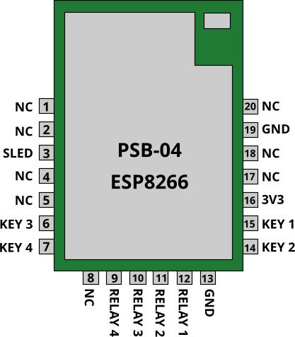

# Diy ESP8266 PSB-04-CN 4ch Relay

Creating A 4ch relay board with a backup LiPo battery.

Please note: _**This is version 1.0**_, just getting a feel with a lot of wires, testing points and hot glue.

Subsequent versions will be user friendly.

The reason I am using Ewelink module is because all the software and firmware has already been tested and supplied.

I found that using my own software and firmware requires:

- Constant connection to a server
- MQTT support and/or
- HTTP support
- A web frontend and/or
- Mobile application
- API to glue everything together
- Watchdog in software and/or in hardware
- Firmware with many fail-safe attributes

So instead of doing all the above aforementioned work using a simple module saves time.

However just the module costs 3 times more than purchasing an ESP8266 module by itself and not Ewelink programmed.

I hope to find cheaper modules Ewelink programmed in future.

---

Relay board v1.0 made on strip board.

GPIO-0 and Channel must be brought to GND for 5s to go into pairing mode.

First time I had to use Ewelink compatible mode for old firmware v1.1.0

 - Features
    - Power part
        - 5v USB-A (plugs in to cellphone charger etc.)
    - Battery part
        - LiPo battery backup 5000mAh
        - Charge and Discharge, Over Current Protection (OCP), Over-Voltage Protection (OVP), Short Circuit Protection (SCP), Over Temperature Protection (OTP)
        - 2A current
    - Board part
        - Ewelink ESP8266 PSB-04 
        - 4 relays
        - No firmware or software needed (use Ewelink features)

- Suggested improvements
    - Move ststus LEDs away from relay NO and NC area (Danger if high voltages used)
    - Opto-Isolate relays [PC817 Opto Isolator](https://www.robotics.org.za/PC817-DIP)
    - Use TP4056 1A basic LiPo charger instead of 2A MH-CD42 (overkill and less reliable, more expensive) [TP4056](https://www.robotics.org.za/PK4056?search=4056) or [with DC-DC Boost](https://www.robotics.org.za/J5019?search=step%20up)
    - Maybe use 18650 batt instead of 21700 (less capacity but more common) [18650 Battery Holder](https://www.robotics.org.za/18650-1C-TH?search=18650) and [18650 Battery](https://www.robotics.org.za/INR18650-35E?search=18650)
    - Replace overkill 1A Diode with [1N4148](https://www.robotics.org.za/1N4148)
    - Look for newer and cheaper Ewelink programmed ESP module
    - Add female headers for all modules

- Price list (no opto isolater and no battery)
    - R147.20 1x ESP8266 Based 4-Channel Switch
    - R32.20 4x relays (R8.05 for 1)
    - R13.80 1x AMS1117 3.3V Regulator Module
    - R25.30 1x Veroboard 100 x 100 mm
    - R41.40 1x LiPo Charger 3.7V with DC-DC Boost 4.5-24V
    - R135.70 1x Samsung 18650 3500mA 3.7V
    - R10.35 1x battery holder
    - R11.50 x1 USB A Pictail Cable, 30cm

Total: R417.45 as of 15th Sep 2022

Without battery: R281.75

R12.66 for 1 3.3v relay [SUGAR CUBE SEALED RELAY](https://www.communica.co.za/products/hf3fa-003-zstf136) no DC-DC boost needed

## Stripboard Planning

https://veecad.com

https://electronics.stackexchange.com/questions/1600/stripboard-veroboard-matrix-board-design-software

https://electronicsclub.info/stripboard.htm

https://www.instructables.com/Practical-Circuit-Construction-With-Strip-Board/

## Parts list

### Veroboard 100 x 100 mm

Holes are spaced 2.54mm apart

https://www.robotics.org.za/VERO100100?search=veroboard%20100%20x%20100mm

### LiPo charger 

MH-CD42

3.7V Lithium battery to a 5V output with current up to 2.1A

Check out [this](https://github.com/GOTO-GOSUB/MH-CD42-Utility-Board/blob/main/README.md) link because these boards don't always work. I learned the hard way.

Example video: [this](https://www.youtube.com/watch?v=ThIcHJ3ovIk) add a large capaciter across the output.

https://techobsessed.net/tag/mh-cd42/

https://www.robotics.org.za/MH-CD42?search=lipo%20charger%203.7v%202a%20in%205v%20%20%20led%20level%20indicator

### Relay

Songle 10A

5v 10A 250VAC or 30VDC Single Pole - Double Throw (SPDT) relays

https://www.robotics.org.za/SRD-5VDC-SL-C?search=relay%205v%20coil%2010a%20%284%20pack%29

### Battery Holder

21700 lithium-ion cell and has 2 pins underneath

https://www.robotics.org.za/21700-1C-TH?search=21700%20battery%20holder%20-%20pcb%20-%201%20cell

### Battery

21700 Lipo 3.7V 5000mAh Battery

INR21700E 5000mAh Lipo battery and can delivery a formidable 9.8A and a Puls Discharge current of 35A for 10 seconds.

https://www.robotics.org.za/INR21700E?search=lipo%20battery%205000mah%2C%2021700%20standard%2C%203.7v

### Cable

USB Type A Pictail Cable, 1m

https://www.robotics.org.za/USB-A-PICTAIL-1M?search=usb%20a%20pictail%20cable%2C%201m

### 3.3V Regulator

AMS1117 3.3V Regulator Module, fixed 3.3V @ 800mA output

https://www.robotics.org.za/AMS1117-MOD?search=ams1117%203.3v%20regulator%20module

### WiFi module

ESP8266 PSB-04 Module 4-Channel Switch + Free ewelink app control

https://www.robotics.org.za/IM150515008?search=esp8266%20based%204-channel%20switch%20%20%20free%20app%20android%20-%20ios

### Screw Terminal

Screw Terminal Block 3 Pin - 5mm

pitch of 5mm, ends of 22 – 14 AWG wires. They are rated for 250V, 16A

https://www.robotics.org.za/KF301-3P-508?search=screw%20terminal%20block%203%20pin%20-%205mm%20%2810%20pack%29

### Transistor

Transistor BC547

45 V, 100 mA NPN general-purpose transistor

https://www.robotics.org.za/BC547?search=bc5

### LED

Green and red 5mm leds, Recommended Working Current: 20mA (at 2.2V)

https://www.robotics.org.za/LED-05-GRN-17?search=led

### Diode

Diode 1N4007, 1A 1000V

https://www.robotics.org.za/1N4007-10?search=diode

### Resistors

1k resistors
100 ohm resistors

https://www.robotics.org.za/RES-1K-50?search=resistor

https://www.robotics.org.za/RES-100E-50?search=resistor

---

https://www.letscontrolit.com/forum/viewtopic.php?t=2721

