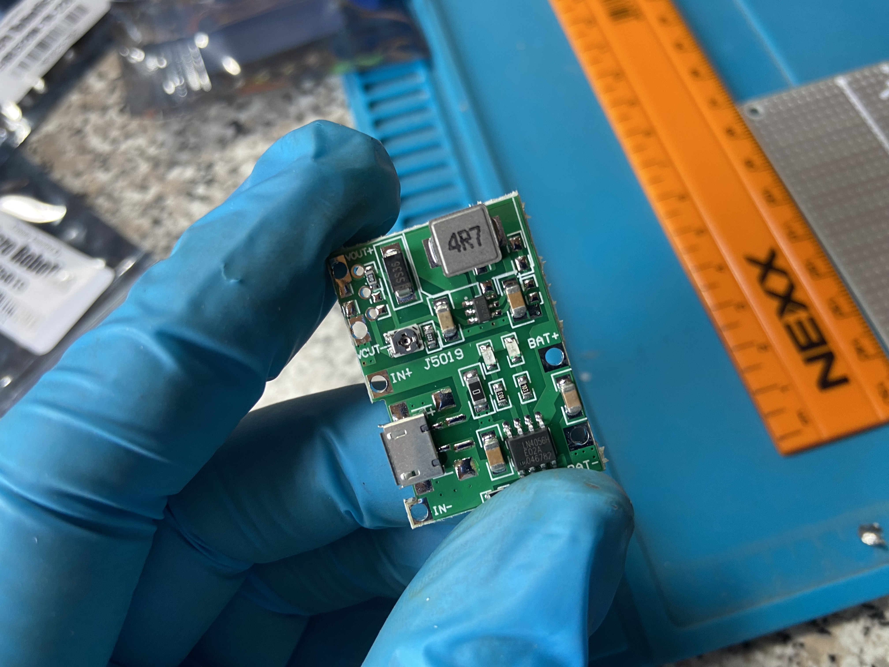
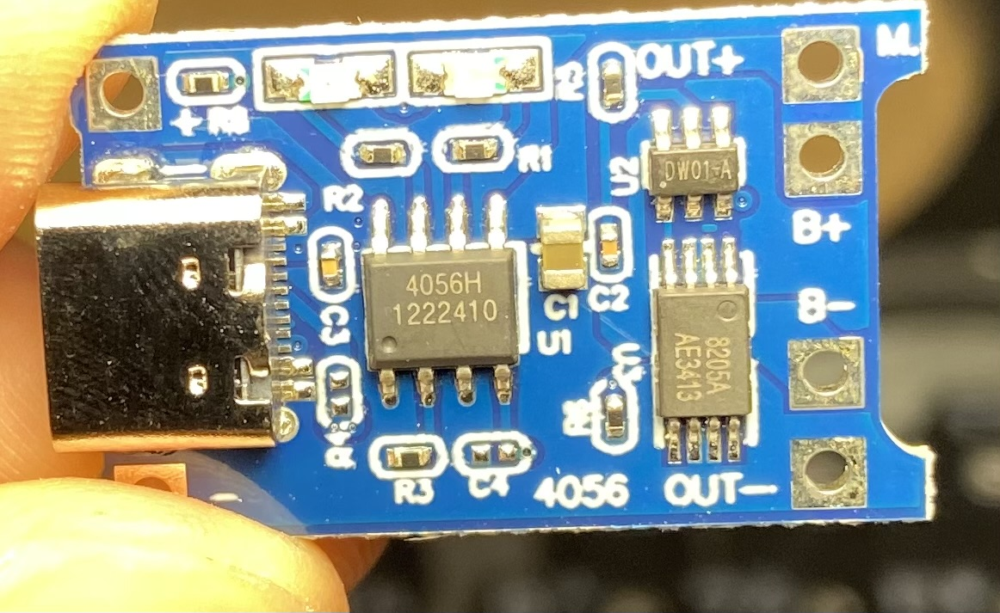
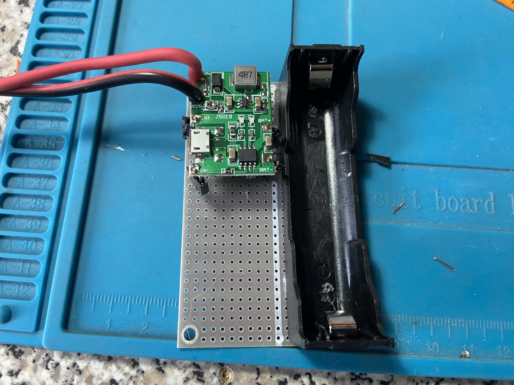

# DIY Mini UPS

PCB with li-ion charger and 18650 batt used to power a WiFi camera for at least 2h.

My article can be found [here](https://tutorials.techrad.co.za/2022/09/26/simple-diy-18650-backup)

LiPo charger: https://www.robotics.org.za/J5019

Old component list:
- 18650 battery holder
- 18650 battery
- Li-ion charger DC step up
- PCB
- Output barrel jack male + 2 core stranded wire

New component list:
- 18650 battery holder
- 18650 battery
- Li-ion charger TP4056
- MT3608 boost converter
- PCB
- Output barrel jack male + 2 core stranded wire

Biggest change is the seperate TP4056 charger that now cuts off more reliably.

